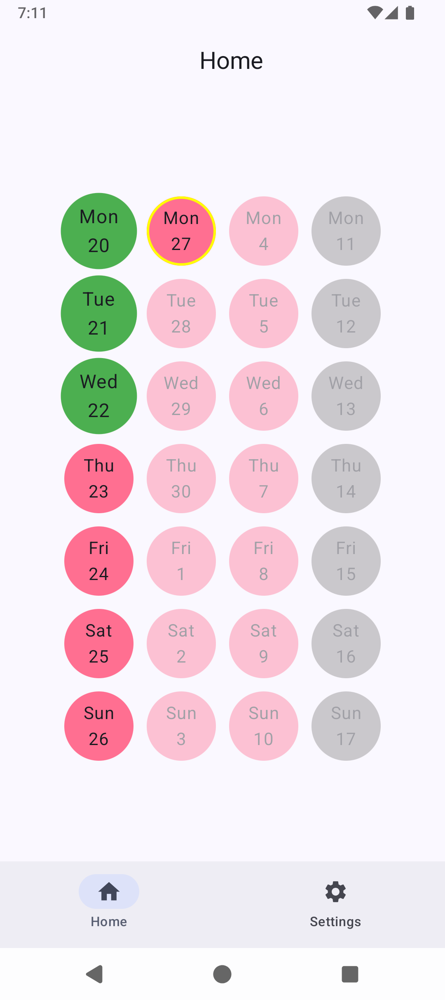

   
  
  <h1>OpenPillReminder</h1>

  
  

  <h3>OpenPillReminder is an open source lady pill tracker for Android</h3>

  

# Copyright and Licensing

Copyright 2026 © Alex Marín

Released under the terms of the [GPL-3.0](./LICENSE)